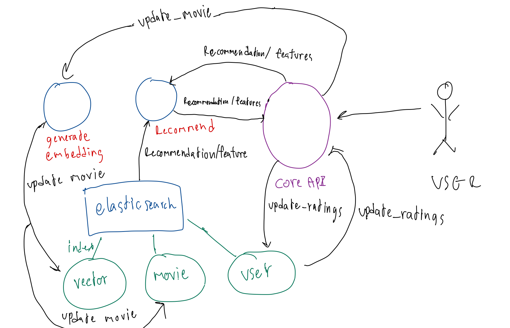
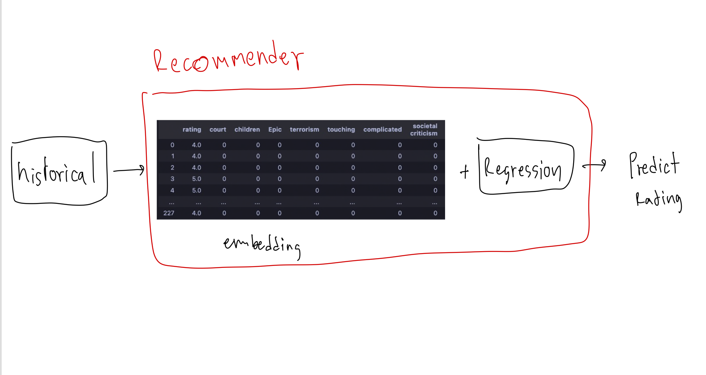
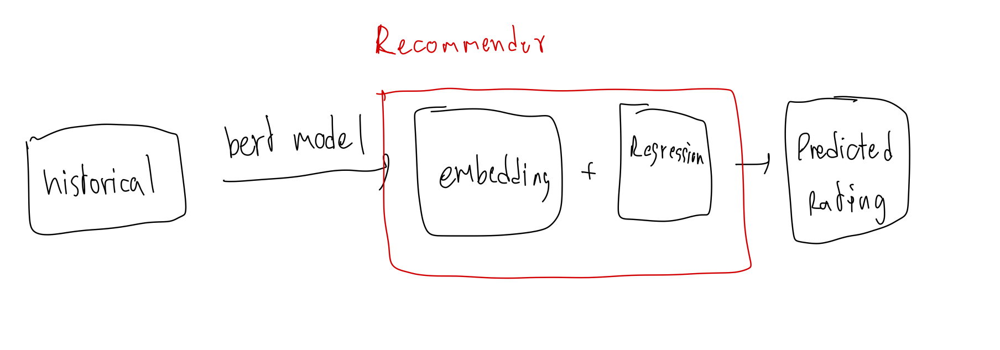

# movie-recommender-api
# Table of contents
1. API
    - [what does it do](#what-does-movie-recommendation-api-do)
    - [API endpoint](#api-endpoints)
    - [Run Locally](#run-api-locally)
    - [why i do architecture like this](#why-these-architecture)
2. Database
    - [elastic search](#elasticsearch)
3. Model Development
    - [Model training](#model-training)
    - [Model Evaluate](#model-evaluate)
4. Model Deployment
    - [Model Deployment](#model-deployment)
5. What's Next
    - [Database]()
    - [Model Development]()
## What does movie-recommendation-api do
It contains `CoreAPI`, `recommender-api` and `embedding-generator` use to do all tasks that relevant to Recommendation System.
#### Supported Task

|endpoints|tasks|
|---------|-----|
|`/recommendations`| recommendation per user|
|`/features`| histories watch per user|
|`/update_ratings`| update user data such as rating, histories|
|`/update_movie`| update movie data such as genres, title, tags|

## API Endpoints
### `/recommendations`
when request come in `Core API`, `Core API` will send request to `recommendation-API` to process this tasks

Input: 
- `user_id:str`
- `returnMetadata:bool` => if True this endpoint will be return others movie features to output

example of output

when `returnMetadata=True`
```
{'items': [{'movie_id': '1', 'title': 'Toy Story (1995)', 'genres': 'Adventure|Animation|Children|Comedy|Fantasy', 'tags': 'fun|pixar'}, {'movie_id': '2', 'title': 'Jumanji (1995)', 'genres': 'Adventure|Children|Fantasy', 'tags': 'game|Robin Williams|magic board game|fantasy'}]}
```

when `returnMetadata=False`

```
{'items': [{'movie_id': '1'}, {'movie_id': '2'}]}
```
### `/features`
when request come in `Core API`, `Core API` will send request to `recommendation-API` to process this task

Input: 
- `user_id:str`

example output
```
{
"features": [
    {
    "histories": ["185135",
    "180777", "180095", "177593"]
    }
    ]
}

```

### `/update_ratings` 
when request come to `Core API`, `Core API` will be connect to elasticsearch to save ratings data to ratings_index

Input:
- ratings_input: use "rating_id" as key and {"movie_id": str, "rating": list[float]} as a value

input example:
```
user_ratings_data = {
    "1": {
        "movie_id": "123",
        "rating": [4.1]
    },
    "3": {
        "movie_id": "456",
        "rating": [5.0]
    }
}
```

### `/update_movie`
when request come to `Core API`, `Core API` will be connect to `generate-embedding API` to generate embedding, use elasticsearch to save generate embedding, movie_id to vector_index and save movie features to movie_index

Input:
- movie_input: use "movie_id" as key and {"title":str, "genres":str, "tags":str} as a values

Input Example:
```
{'1': {'movie_id': ['1', '3', '6'], 'ratings': [4.0, 4.0, 4.0]}}
```

## Run API Locally
## Setup
0. Install dependencies
```
pip install -r requirements.txt
```
1. cd to `embedding_generator` and run command to download model
```
cd embedding_generator
make init_model
cd ..
```
2. run docker compose
```
docker compose up --force-recreate --build
```
3. cd to `api` to start fastapi server
```
cd api
uvicorn app:app --port 1111 --reload
```
4. see more [example](https://github.com/mhokchuekchuek/movie-recommender/tree/main/example/create_index_and_call_api)
## Why these architecture

- it easy to add or remove any components
- it easy to Scale because all component is less dependent on others.

## Elasticsearch
elasticsearch can be collect several datatype such as text, vector etc.In this project I create 3 indicies to collect all thing that relate to movies data.
### index:
- `vector_index:` contain `movie_embeddings` and `movie_id`
- `movie_index:` this index collect movie feature, contain `movie_id`, `title`, `genres` and `tag`
- `user_index:` this index collect user feture, contain `movie_id` and `ratings`

### Why we collect embedding to elasticsearch
this recommendation must have to generate movie embedding that consumes lot of time, so i decided to collect movie embedding to elasticsearch.

### Why i seperate vector_index from movie_index
because when we retrieve query from `movie_embedding`, it consumes lot of time, So i decided to seperate it from `movie_index`

## Model development
### Model Training
- Matrix Factorization:

    i skip this because this method because
    - cannot handle fresh items
    - hard to include side feature for query/item

- Embedding + Regression:

    sparse matrix + regression
    
    - convert movie features to sparse matrix

    - train these feature with RandomForestRegressor for predict ratings

    - rank ratings by descending

     bert + regression

    

    - use `'bert-base-nli-mean-tokens'` for generate embedding and train these feature with RandomForestRegreesor to predict ratings
    - rank ratings by descending

## Model Evaluate
seperate train 80% and test 20% and evaluate test with rmse
|recommender_type|rmse|
|----------------|----|
|sparse matrix + rf| 0.96|
|bert + rf| 0.91|

From the result
- bert + rf is putperform.
- bert + rf vector size is constant, it would be better if they add new features such as add new_genre, sparse matrix + rf must have to renew sparse matrix because vector size change.

## Model Deployment
`bert_model` is deployed to `embedding generator api` and `RandomForestRegressor` is deployed to `recommender api`

### Recommender API
i found it in training, the least number of historical is 20, I'm not confidence if historical is less, it will got wrose predict.
So i decided to use cosine similarity from movie embedding as a recommendation instead

```
if historical 20:
    get recommendation from cosine_similarity
else:
    get recommendation from historicals
```
## What's Next
### Database
- find a way to decrease time when we query with vector

### Model Deployment
Improve Accuracy
- try other methods such as Matrix Factorization, Softmax DNN for Recommendation, or the best model from paperwithcode
- find the way to improve movie embedding

Reduce resource utilzation
- do the cluster to group user that have personalization\
example:\
user_a watch  => movie_a, movie_c, user_b watch => movie_b, movie_c\
if two user have the same peresonalize we can recommend movie_b to user_a and recommend movie_a to user_b
